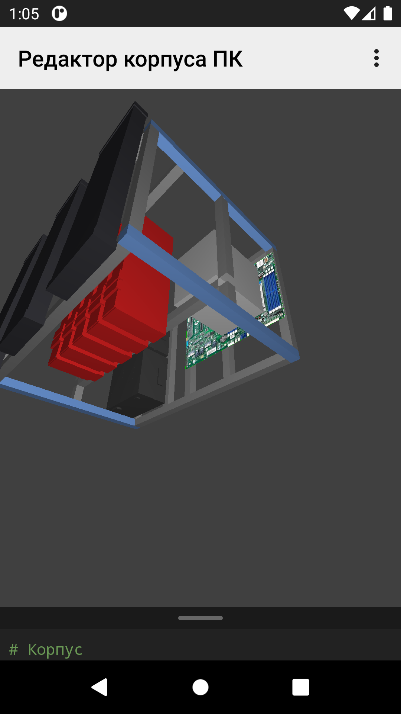

## 3D PC Case Generator & Keyboard Designer



Три варианта рендеринга:

### 1. PC Viewer (JOGL GUI)
```bash
./gradlew :viewer:run
```

### 2. Console — PNG render (headless)
```bash
./gradlew :pccase:run --args="--render"
```
Output: `pccase/stl_pccase/scene.png`

### 3. Android App (OpenGL ES)
```bash
cd android-viewer
./gradlew assembleDebug
```
APK: `android-viewer/app/build/outputs/apk/debug/pc-frame-viewer.apk`

В запущенный эмулятор устанавливается так (см. `AGENTS.md` в `~/projects/android/` запуск докера с AVD):

```bash
docker cp android-viewer/app/build/outputs/apk/debug/pc-frame-viewer.apk android-emulator:/tmp/
docker exec android-emulator adb install -r /tmp/pc-frame-viewer.apk
docker exec android-emulator adb shell am start -n com.github.grishberg.cad3d/com.github.grishberg.viewer.Cad3dActivity
```

---

## Modules

| Module | Type | Назначение |
|--------|------|------------|
| `cad3d` | JVM | Генерация сплита, STL экспорт |
| `javascad` | JVM | CSG движок |
| `plugin` | JVM | Интерфейсы плагинов |
| `viewer` | JVM | Десктопный просмотрщик (JOGL) |
| `console` | JVM | Консольный экспорт STL |
| `pccase` | JVM | Модель корпуса ПК |
| `kbd_core` | JVM | Ядро клавиатуры |
| `common` | JVM | Общие утилиты |
| `android-viewer` | Android | Android приложение с OpenGL ES |

## DSL конфигурации корпуса

Скрипт задаётся в редакторе приложения (кнопка «Редактор» в меню) или как дефолтный
(`getDefaultScript()` в `config-parser`). Синтаксис 1-в-1 с web-версией
`pc_viewer_3d`. Дефолтный скрипт:

```
# Корпус
frame (w=540 d=340 h=400) {
  # Нижние ребра
  bottomEdge (x=-30)
  bottomEdge (x=100)
  bottomEdge (x=-115)
  # Передняя штанга под видеокарты
  frontEdge(y = 60 z=200)
  # Задняя штанга под видеокарты
  backEdge(z=310)
  # Боковые промежуточные штанги
  rightEdge(z=200)
  leftEdge(z=200)
}

# Матплата
move(114 30 20.8) motherboard()
# Видеокарты
move(-120 0 270) gpu (n=5 s=55)
# БП — блок с общими transform'ами
move(x=-190 z=65) {
  move(y=75) rotate(90 0 0) psu()
  move(y=-75) rotate(90 0 0) psu()
}
move(150 35 105) cooler()
move(0 0 420) {
  radiator()
  move(x=200) radiator ()
  move(x=-200) radiator ()
}
```

| Конструкция | Описание |
|-------------|----------|
| `frame(w=… d=… h=…)` | рамка: ширина/глубина/высота в мм (низ — z=0). Параметров `l=` и `b=` больше нет |
| `bottomEdge(x=…)` | нижняя балка вдоль Y на X-координате; строки в блоке `frame { … }` или отдельными — попадают в рамку |
| `frontEdge(z [x] [y] [l])` / `backEdge(…)` | балка вдоль X у передней (−Y) / задней (+Y) стенки. `z` обязательно, `x` — смещение от центра по X, `y` — сдвиг от стенки, `l` — длина (default весь пролёт w−40мм) |
| `leftEdge(z)` / `rightEdge(z)` | балка вдоль Y у левой/правой стенки, default d−40мм |
| `move(x y z)` / `move(x=… y=… z=…)`, цепочки из `rotate(… …)` | transform'ы компонента или блока `{ }` (вложенные строки наследуют их) |
| `motherboard() gpu(n s) psu() cooler() radiator()` | компоненты; балки (`*Edge`) относятся к рамке — на них не действуют transform'ы |

В пункте меню «Отчёт» — спецификация нарезки профиля 20×20 (длина каждого вида куска
и общая длина), формат тот же, что у web-версии.

## Требования для Android сборки
- JDK 21
- Android SDK с `platforms;android-34` и `build-tools;34.0.0`

## VM options для десктопа

```
--add-exports=java.desktop/sun.awt=ALL-UNNAMED
--add-opens=java.desktop/sun.awt=ALL-UNNAMED
```
